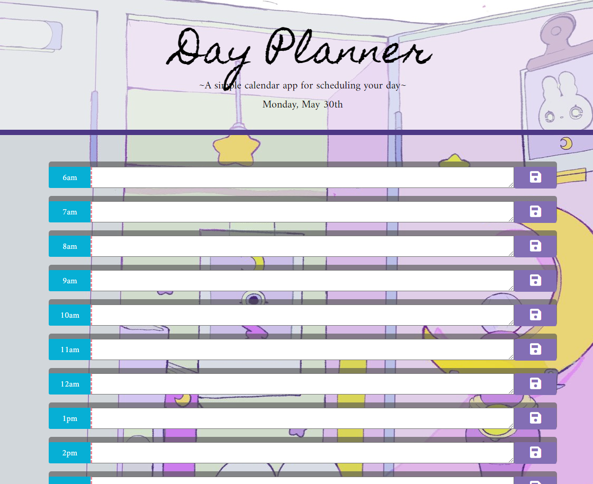

# Third-Party APIs: Day Planner

## by Sophia De La Rosa

Use this simple planner to schedule your day by filling in tasks into the hour timeblocks. Inputs begin at 6am for early risers and end at 8pm for late nights at work or planning dinners. The date is listed at the top of the page and will always be correct. Hitting the save button after writing in the textbox will save your input, even on refreshing the page. Hour blocks are color coded based on the current time, which updates every 15 seconds. Past timeblocks have a gray tab, future timeblocks are tabbed in green and the current timeblock is highlighted in yellow. 

The following photo demonstrates the application functionality:

## Links

Deployed application link:
https://sophiadelarosa.github.io/05-Workday-Scheduler/

Github link:
https://github.com/sophiadelarosa/05-Workday-Scheduler
